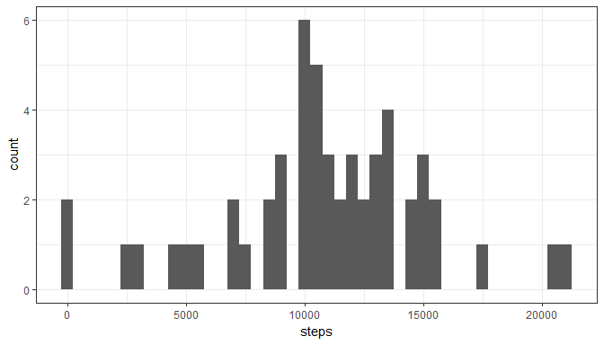
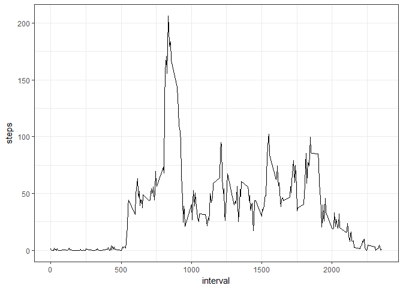
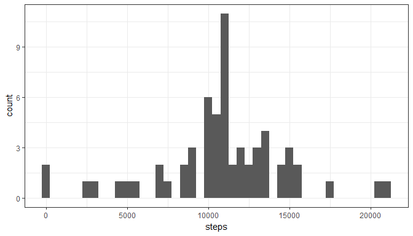
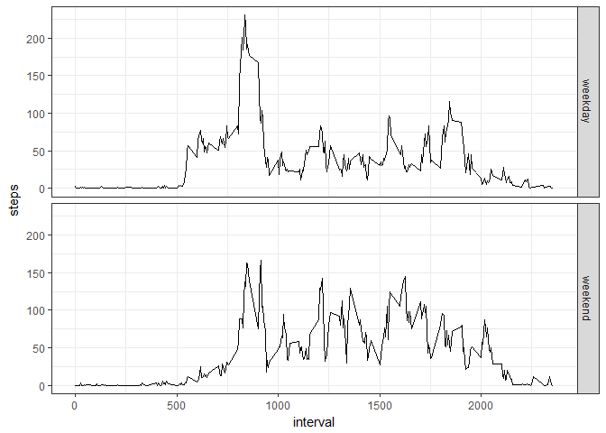

# Reproducible Research: Peer Assessment 1


## Loading and preprocessing the data


```r
unzip("activity.zip")
activityraw <- read.csv("activity.csv")
activity <- activityraw[complete.cases(activityraw), ]
```

## What is mean total number of steps taken per day?

Calculate the total number of steps per day:


```r
stepday <- setNames(aggregate(activity$steps, by = list(activity$date), FUN = sum), 
                    nm = c("date", "steps"))
```

A histogram of the total number of steps per day:


```r
library(ggplot2)
qplot(steps, data = stepday, binwidth = 500) + theme_bw()
```

<!-- -->

Calculate the average and median number of steps per day:


```r
meansteps <- mean(stepday$steps)
medsteps <- median(stepday$steps)
```

The average number of steps per day is 1.0766189\times 10^{4}.  
The median of the number of steps per day is 10765.

## What is the average daily activity pattern?

A plot of the average daily activity:


```r
stepint <- setNames(aggregate(activity$steps, by = list(activity$interval), FUN = mean), 
                    nm = c("interval", "steps"))

qplot(interval, steps, data = stepint, geom = "line") + theme_bw()
```

<!-- -->

Identify the interval with maximum average number of steps:


```r
maxsteps <- stepint[order(stepint[, 2], decreasing = TRUE), ][1, 1]
```

The maximum number of steps is taken on overage on the interval 835.

## Imputing missing values

Calculate number of rows including missing values (NA):


```r
countna <- dim(activityraw[!complete.cases(activityraw), ])[1]
```

The number of rows including missing values is 2304.

Fill in missing values with the mean average step number for each interval:


```r
naraws <- activityraw[!complete.cases(activityraw), ]
splitnaraws <- split(naraws, naraws$interval)

filled <- data.frame()

for(i in splitnaraws) {
  i$steps <- stepint[stepint$interval == i[1, 3], 2]
  filled <- rbind(filled, i)
}
```

Create a data ftame including the estimated values:


```r
activityfilled <- rbind(activity, filled)
activityfilled <- activityfilled[order(activityfilled$date, activityfilled$interval), ]
```

A histogram of the total number of steps per day including the estimated values:


```r
eststepday <- setNames(aggregate(activityfilled$steps, by = list(activityfilled$date), FUN = sum), 
                    nm = c("date", "steps"))
qplot(steps, data = eststepday, binwidth = 500) + theme_bw()
```

<!-- -->

Calculate the average and median number of steps per day including the estimated values:


```r
estmeansteps <- mean(eststepday$steps)
estmedsteps <- median(eststepday$steps)
```

The average number of steps per day is 1.0766189\times 10^{4}.  
The median of the number of steps per day is 1.0766189\times 10^{4}.

Calculate differences of mean and median values before and after filling in missing values:


```r
deltamean <- meansteps - estmeansteps
percmean <- deltamean / meansteps * 100
deltamed <- medsteps - estmedsteps
percmed <- deltamed / medsteps * 100
```

Mean steps per day changed by 0 which equals to 0%  
Median steps per day changed by -1.1886792 which equals to -0.0110421%

## Are there differences in activity patterns between weekdays and weekends?

Create a new factor variable indicating whether a given date is a weekday or weekend day:


```r
activityfilled$day <- weekdays(as.Date(activityfilled$date))
activityfilled$weektime[activityfilled$day == "Saturday" | activityfilled$day == "Sunday"] <- "weekend"
activityfilled$weektime[is.na(activityfilled$weektime)] <- "weekday"
activityfilled$weektime <- as.factor(activityfilled$weektime)
```

A plot displaying average daily activity during weekdays and weekends:


```r
stepintwday <- setNames(aggregate(activityfilled$steps[activityfilled$weektime == "weekday"], 
                                  by = list(activityfilled$interval[activityfilled$weektime == "weekday"],
                                  activityfilled$weektime[activityfilled$weektime == "weekday"]), 
                                  FUN = mean), nm = c("interval", "weektime", "steps"))

stepintwend <- setNames(aggregate(activityfilled$steps[activityfilled$weektime == "weekend"], 
                                  by = list(activityfilled$interval[activityfilled$weektime == "weekend"],
                                  activityfilled$weektime[activityfilled$weektime == "weekend"]), 
                                  FUN = mean), nm = c("interval", "weektime", "steps"))

stepintall <- rbind(stepintwday, stepintwend)

qplot(interval, steps, data = stepintall, geom = "line") + theme_bw() + facet_grid(weektime ~ .)
```

<!-- -->
